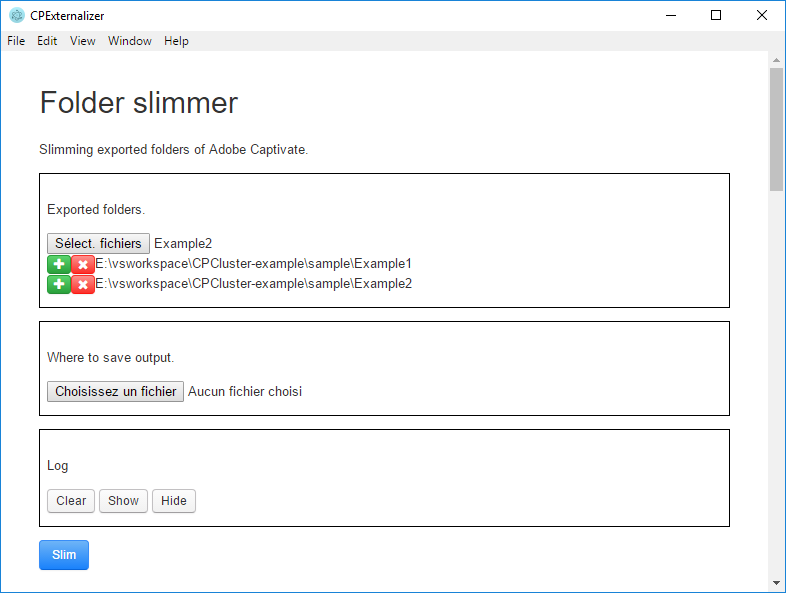
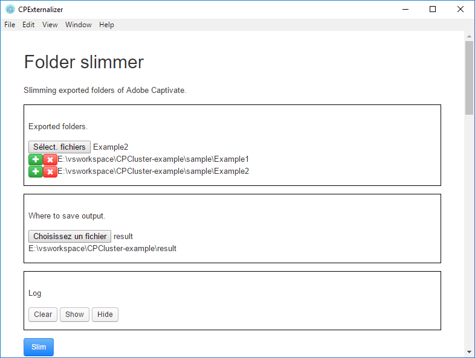
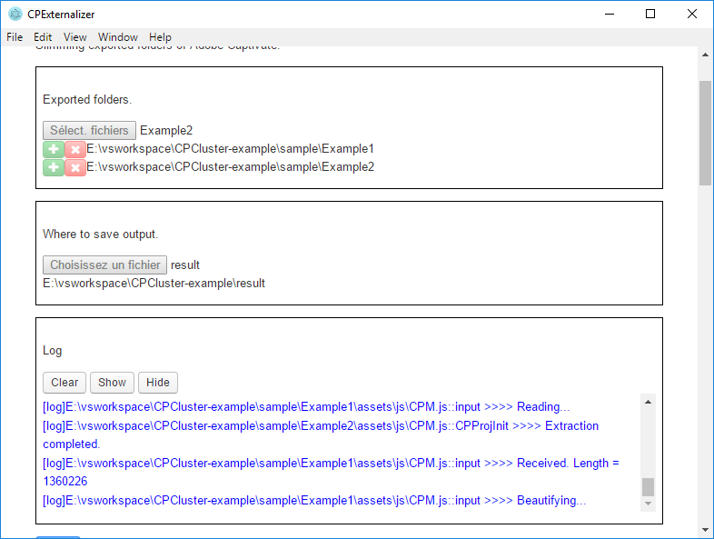
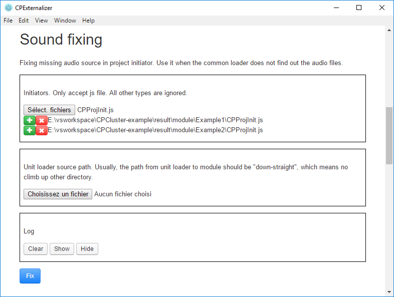
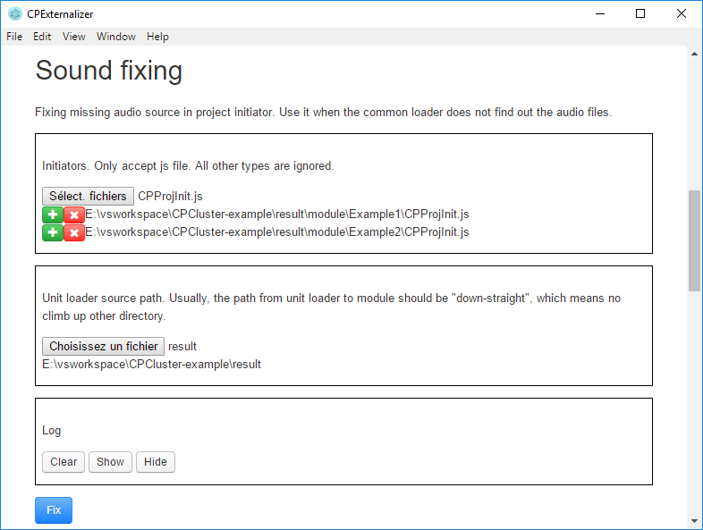
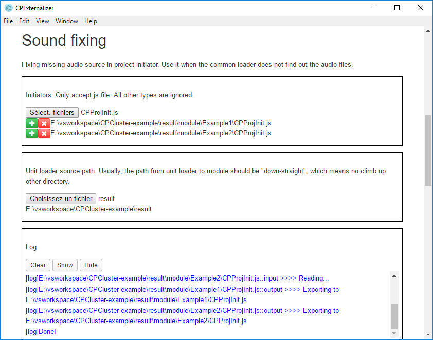

Scenarios of using [CPExternalizer](https://github.com/perfectstrong/CPExternalizer) via its [CLI](https://github.com/perfectstrong/CPExternalizer-CLI) or its [GUI](https://github.com/perfectstrong/CPExternalizer-GUI), in order to minimize the size of grouping Captivate HTML5 modules.

Use cases:
1. [Complete factorisation](#complete-factorisation).
1. [Slim down a specific initiator](#slim-down-a-specific-initiator).
1. [Discover unexpected components](#discover-unexpected-components).

## Motivation & Solution in general

Adobe Captivate supports exporting modules to HTML5 format, included a lot of resources identical among modules, which lead to an excessive amount memory if we have to put plenty of them together.

That's why we came up the idea of clustering those modules into one _"mini theater"_ having one projector and multiple catridges loaded should the needs arises.

### Cluster

The structure of cluster will resemble this:
````
cluster/
+--index.html
+--unitLoader.html
+--assets/
+--module/
````

* **unitLoader**: the projector which loads and displays the chosen module.
* **assets**: containing all reusable resources:
  * css/
  * htmlimages/
  * js/
  * playbar/
  * toc/
  * TOC_icons/
* **module**: catridge box. Each module should be a separated folder slimmed down by CPExternalizer. For example:
````
+--module/
   +--module1/
   +--module2/
````

### CPM.js - initiator & components
The main file of module. Normally, it will be at `assets/js/CPM.js`. It should be composed of 2 parts:
* **CPProjInit**: _initiator_, containing all detailed descriptions of objects (text, images, sound, etc.) shown in project. It is private per project. That's why we will extract it into a standalone file.
* **Components**: _animator_, which will decorate the page and manage all internal "movements" of project. This part can be duplicated between them, thus we can factorize.

Besides, two folders `assets/ar` (containing audio files) and `assets/dr` (containing images files) will be also picked out along **CPProjInit**.

### Unit loader
We can write the unit loader in any web developping language, but in this example, we will reuse mostly what is written in `index.html` of each exported Captivate project with a little help of javascript.

This loader will be called in an _iframe_ inside `cluster/index.html`.

### Assets
Container of common resources of these modules. Pay attention to `assets/js/CPM.js` because we will replace it by a version covering all _components_ found in projects, but not holding any _initiator_.

You can take the `assets` folder in this folder as the base for your cluster. In that case, make sure to update them regularly in order to have a good performance.
## Installation & preparation

### Sample modules

_sample_ contains HTML5 modules exported by Adobe Captivate without any "factorisation". You can use them for this tutorial.

### CLI
If you are used to CLI, this is right for you.

_**Requirements**_: Node >= v8.9.1

_**Install**_:
* via git clone:
````bash
git clone https://github.com/perfectstrong/CPExternalizer-CLI
cd CPExternalizer-CLI
npm install
# ready to run
````
* via download whole source: [here](https://github.com/perfectstrong/CPExternalizer-CLI/archive/master.zip). Extract to a folder and open a bash there. Run also `npm install` to install the dependecies. Now it's ready.

### GUI
Easy to use. Check out [the lastest release](https://github.com/perfectstrong/CPExternalizer-GUI/releases) to get a bundled build.

Or you can build by yourself. _**Requirements**_:
* Node >= v8.9.1.
* Electron ~1.7.11.
````bash
git clone https://github.com/perfectstrong/CPExternalizer-GUI
cd CPExternalizer-GUI
npm install
npm start
````

## Use cases

### Complete factorisation
Suppose that we're having 2 modules exported by Adobe Captivate and we want to integrate them into our cluster.
````
+--Example1/
+--Example2/
````

#### Step 1: Folder slimmer

**GUI**

1. In the _**Folder slimmer**_ section, at _Exported folders_, choose those 2 above. _Note_: for instance, you can only choose one per time, but you can always add another by clicking on either the first button or the plus(+) button (the cross(x) button will remove your choice instead).


1. Set a place to save your result.


1. Click _**Slim**_ to begin the task.


1. Then put your results in `cluster/module`.

**CLI**

````bash
node main.js dirext --src "E:\vsworkspace\CPCluster-example\sample\Example1" "E:\vsworkspace\CPCluster-example\sample\Example2" --outdir "E:\vsworkspace\CPCluster-example\result\module"
````

#### Step 2: Grab the common resources
In these modules, pick the `assets` folder which you judge more "general", covering all necessary components. Then place in `cluster`.

##### Step 2.1: Replace CPM.js
Replace `cluster/assets/js/CPM.js` by the full version [here](result/assets/js/CPM.js).

##### Step 2.2: Replace CPLibraryAll.css
Sometimes, if your module contains questions, you should also replace `cluster/assets/css/CPLibraryAll.css` by [this](result/assets/css/CPLibraryAll.css).

##### Step 2.x: Etc.

#### Step 3: Develop `index.html` and `unitLoader.html`
The `unitLoader.html` takes mots part of `index.html` inside an exported project, with the changes in resources to load.

* `cpXHRJSLoader.css()` is the method to load css files.
* `lJSFiles` is the list of JS files to load. (We will use it to charge our catridge `CPProjInit.js`.)
* `imageJSONFiles` is the list of images encoded in Base64 and saved in `dr` folder. Example: `dr/img1.json`, `dr/img2.json`, etc.
* `imagesJSONFiles` is the map of images in `dr` folder.

In this tutorial, we use a static variable to store resources path of module, then transmit to iframe by `sessionStorage`.
#### Step 4: Fix sound
If your projects have sounds or music, their audio resources will saved in `ar` and their path will be in `CPProjInit.js`. However, due to the factorisation, the path has changed. Therefore, we need to fix it right away.

**GUI**

1. In the _**Sound fixing**_ section, firstly choose the initiators above (`CPProjInit.js`) in your cluster. You can choose multiple file simultaneously. Use plus(+) to add other files and cross(x) to remove a choice.


1. Next, choose your unit loader (where you put the loader). Because the links in initiator are relative, you have to place the unit loader so that it can access _directly_ to the audio files, for example: `module/example1/ar/Mouse.mp3` (`unitLoader.html` is in the same directory with `module/`).


1. Lastly, click _**Fix**_ to begin fixing. The result are saved right into input files.


**CLI**
````bash
node main.js soundfix --src "E:\vsworkspace\CPCluster-example\result\module\Example1\CPProjInit.js" "E:\vsworkspace\CPCluster-example\result\module\Example2\CPProjInit.js" --ulpath "E:\vsworkspace\CPCluster-example\result\unitLoader.html"
````

With CLI, you can even give an entire directory as the source. The program will automatically search all js files inside and fix those who are initiators.

````bash
node main.js soundfix --src "E:\vsworkspace\CPCluster-example\result\module" --ulpath "E:\vsworkspace\CPCluster-example\result\unitLoader.html"
````

#### Step 5: Test & Enjoy
Now, the cluster should be fine.

_**Attention**_: See the [contribution](#contribution) part.

### Slim down a specific initiator
This is a part of the factorisation.

**GUI**
1. In _**Project initiator**_ section, firstly, choose the path(s) to non-externalized `CPM.js`. Multiple choice possible. Add another by (+). Remove by (x).
1. Choose a folder to save the result.
1. Click _**Extract**_ to begin.

_Attention_: the name of exported file will be numbered randomly.

**CLI**
````bash
node main.js extract --src path/to/CPM.js path/to/an/other/CPM.js etc/CPM.js --outdir path/to/a/folder/to/store
````

### Discover unexpected components
If your unit loader does not function right, maybe the common `CPM.js` still miss some components. This feature can help you discover them (although not very stable result).

**GUI**
1. In the _**Extra components**_, give the path(s) to the non-modified `CPM.js`. Multiple choice possible. Add another by (+). Remove by (x).
1. Choose a folder to save the result.
1. Choose a sample `CPM.js` file to compare. You can use the one given by program. Or you can use your own common `CPM.js`.
1. Click _**Extract**_ to begin.

## Contribution
There are perhaps minor differences in resources between projects that we still can not find out. Please be kind to raise an issue [here](https://github.com/perfectstrong/CPCluster-example/issues) with your source if the unit loader does not display your projects correctly.